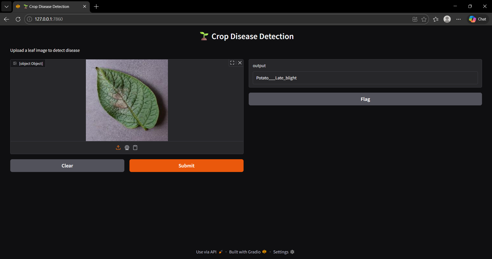

\# AI-Powered System for Finding Crop Diseases

\#Summary

This project is a deep learning system that uses computer vision to find crop diseases in pictures of leaves.

It uses a pretrained EfficientNet model and is set up as an interactive web app where people can upload an image and get predictions right away.

\#Features

\-Upload a picture of a leaf

\-Use deep learning to guess what kind of disease will affect crops

\-Gradio-based interactive web interface

\-Quick CPU inference

\#Model Information

\-Model: EfficientNet(Learning by Transfer)

\-Framework: PyTorch

\-The dataset is called PlantVillage

\-Size of Input: 128x128

\-Accuracy: 45-70% (depends on training)

\#Tech Stack

\-Python

\-PyTorch

\-torchvision

\-timm

\-Gradio

\-PIL

\#How the project is setup

crop-disease-project/

│

├── src/

│ ├── data\_loader.py

│ ├── model.py

│ ├── train.py

│ ├── predict.py

│ └── app.py

│

├── outputs/

│ └── model.pth

│

├── data/ (not included in repo)

├── README.md

└── requirements.txt

\#How to run

1. Clone Repository

git clone <your-repo-link>

cd crop-disease-project

2\. Create Virtual Environment

python -m venv crop\_env

crop\_env\\Scripts\\activate

3\. Install Dependencies

pip install -r requirements.txt

4\. Run App

python src/app.py

#App Screenshot

